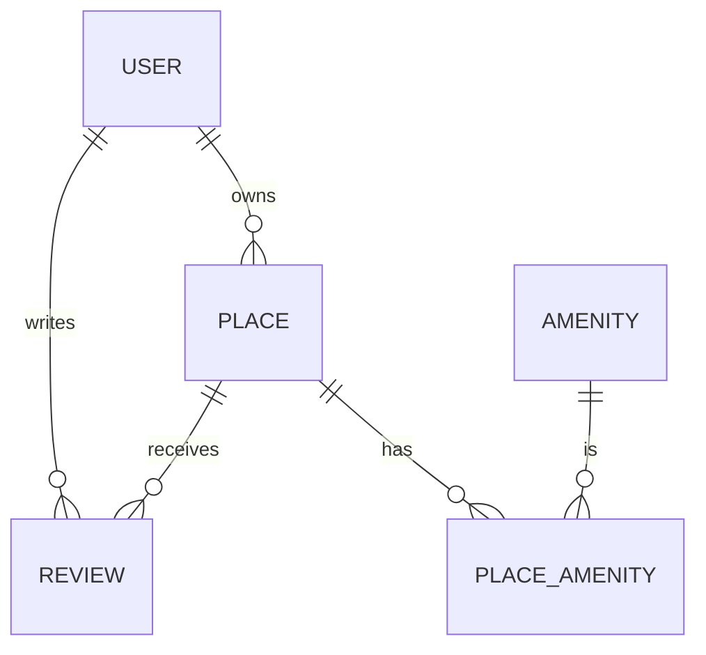

# HBnB Evolution

> A full-stack Airbnb-like application built in multiple phases, focusing on clean architecture, RESTful API design, authentication, and database integration.


---

## 📑 Table of Contents

- [📘 Overview](#-overview)
- [🏗️ Project Structure](#-project-structure)
- [⚙️ Technologies](#-technologies)
- [🚀 Getting Started](#-getting-started)
- [🔌 API Endpoints](#-api-endpoints)
- [✅ Validation & Security](#-validation--security)
- [🧪 Testing](#-testing)
- [🗺️ Database Design Diagram](#-database-design-diagram)
- [📚 Resources](#-resources)
- [👥 Authors](#-authors)
- [📄 License](#-license)

---

## 📘 Overview

HBnB Evolution is a full-stack project designed to simulate an Airbnb-like application. It is developed in four phases:

1. **Part 1**: Technical documentation and UML diagrams.
2. **Part 2**: RESTful API implementation with Flask and in-memory storage.
3. **Part 3**: Authentication, authorization, and database integration using SQLAlchemy.
4. **Part 4**: Frontend development with HTML5, CSS3, and JavaScript ES6.

---

## 🏗️ Project Structure

```
HBnB/
├── part1/                        # Technical documentation and UML diagrams
│   ├── diagram_class.md          # Class diagram for business logic
│   ├── diagram_package.md        # Package diagram for architecture
│   ├── diagram_sequence.md       # Sequence diagrams for API calls
│   └── Projet HBnB - UML.pdf     # Compiled technical documentation
│
├── part2/                        # RESTful API implementation
│   ├── app/                      # Main application package
│   │   ├── api/                  # Presentation layer (RESTful API)
│   │   ├── models/               # Business logic layer
│   │   ├── services/             # Application layer using Facade pattern
│   │   └── persistence/          # In-memory persistence layer
│   ├── tests/                    # Unit and integration tests
│   ├── config.py                 # App configuration
│   ├── run.py                    # Entry point to launch the Flask app
│   └── requirements.txt          # Project dependencies
│
├── part3/                        # Enhanced backend with authentication and database
│   ├── app/                      # Main application package
│   │   ├── api/                  # RESTful API with authentication
│   │   ├── models/               # Business logic with SQLAlchemy
│   │   ├── services/             # Application layer using Facade pattern
│   │   ├── persistence/          # SQLAlchemy persistence layer
│   │   └── extensions.py         # Flask extensions (db, bcrypt, jwt)
│   ├── instance/                 # SQLite database for development
│   ├── tests/                    # Unit and integration tests
│   ├── config.py                 # App configuration
│   ├── run.py                    # Entry point to launch the Flask app
│   └── requirements.txt          # Project dependencies
│
├── part4/                        # Frontend implementation
│   ├── static/                   # CSS and JavaScript files
│   ├── templates/                # HTML templates
│   └── app.js                    # Main JavaScript file
│
└── README.md                     # Project documentation
```

---

## ⚙️ Technologies

- **Backend**:
  - Python 3.8+
  - Flask (RESTful API framework)
  - Flask-RESTx (API documentation and validation)
  - SQLAlchemy (ORM for database integration)
  - Flask-JWT-Extended (JWT authentication)
  - bcrypt (Password hashing)
- **Frontend**:
  - HTML5, CSS3, JavaScript ES6
  - Fetch API (AJAX requests)
- **Database**:
  - SQLite (Development)
  - MySQL (Production-ready)
- **Testing**:
  - Unittest (Python testing framework)

---

## 🚀 Getting Started

### 1. Clone the repository

```bash
git clone https://github.com/IEyZens/holbertonschool-hbnb.git
cd holbertonschool-hbnb
```

### 2. Set up a virtual environment

```bash
python3 -m venv venv
source venv/bin/activate
# On Windows: venv\Scripts\activate
```

### 3. Install dependencies

```bash
pip install -r requirements.txt
```

### 4. Configure environment variables

Create a `.env` file at the root (recommended):

```env
FLASK_ENV=development
SECRET_KEY=a-very-secret-key
DATABASE_URL=sqlite:///hbnb.db
JWT_SECRET_KEY=another-secret-key
```

### 5. Initialize the database

```bash
flask db upgrade
```

### 6. Run the application

```bash
python run.py
```

- API available at: `http://127.0.0.1:5000/api/v1/`
- Swagger UI: `http://127.0.0.1:5000/`

---

## 🔌 API Endpoints

### **Authentication**

| Method | Endpoint         | Description                      |
| ------ | ---------------- | -------------------------------- |
| POST   | `/auth/register` | Register a new user              |
| POST   | `/auth/login`    | Log in, obtain JWT               |
| GET    | `/auth/me`       | Get current user info (JWT req.) |

### **Users**

| Method | Endpoint      | Description    | Auth Required | Admin Only |
| ------ | ------------- | -------------- | :-----------: | :--------: |
| POST   | `/users/`     | Create user    |      Yes      |    Yes     |
| GET    | `/users/`     | List all users |      Yes      |    Yes     |
| GET    | `/users/<id>` | Get user by ID |      Yes      |    Yes     |
| PUT    | `/users/<id>` | Update user    |      Yes      |    Yes     |
| DELETE | `/users/<id>` | Delete user    |      Yes      |    Yes     |

### **Places**

| Method | Endpoint       | Description     | Auth Required |
| ------ | -------------- | --------------- | :-----------: |
| POST   | `/places/`     | Create place    |      Yes      |
| GET    | `/places/`     | List all places |      No       |
| GET    | `/places/<id>` | Get place by ID |      No       |
| PUT    | `/places/<id>` | Update place    |      Yes      |
| DELETE | `/places/<id>` | Delete place    |      Yes      |

### **Reviews**

| Method | Endpoint                     | Description              | Auth Required |
| ------ | ---------------------------- | ------------------------ | :-----------: |
| POST   | `/reviews/`                  | Create review            |      Yes      |
| GET    | `/reviews/`                  | List all reviews         |      No       |
| GET    | `/reviews/<id>`              | Get review by ID         |      No       |
| PUT    | `/reviews/<id>`              | Update review            |      Yes      |
| DELETE | `/reviews/<id>`              | Delete review            |      Yes      |
| GET    | `/places/<place_id>/reviews` | List reviews for a place |      No       |

### **Amenities**

| Method | Endpoint          | Description       | Auth Required |
| ------ | ----------------- | ----------------- | :-----------: |
| POST   | `/amenities/`     | Create amenity    |      Yes      |
| GET    | `/amenities/`     | List amenities    |      No       |
| GET    | `/amenities/<id>` | Get amenity by ID |      No       |
| PUT    | `/amenities/<id>` | Update amenity    |      Yes      |
| DELETE | `/amenities/<id>` | Delete amenity    |      Yes      |

---

## ✅ Validation & Security

- **Password Security**: bcrypt hash, never stored or transmitted in plain text.
- **Email Uniqueness**: Enforced at database and API level.
- **JWT**: All sensitive endpoints protected; tokens required in `Authorization: Bearer`.
- **Field Validation**: Email format, lat/lon bounds, rating (1-5), required fields.
- **Input Sanitization**: Prevents SQL injection and XSS.
- **Admin Endpoints**: Only accessible to users with `is_admin=True`.

---

## 🧪 Testing

### Run all tests

```bash
python3 -m unittest discover -s tests -p "test_*.py"
```

---

## 🗺️ Database Design Diagram

**Entity-Relationship Diagram with mermaid.js:**



---

## 📚 Resources

- [Flask-JWT-Extended Documentation](https://flask-jwt-extended.readthedocs.io/en/stable/)
- [SQLAlchemy Documentation](https://docs.sqlalchemy.org/en/20/)
- [Alembic Migrations](https://alembic.sqlalchemy.org/)
- [SQLite Documentation](https://sqlite.org/docs.html)
- [MySQL Documentation](https://dev.mysql.com/doc/)
- [Mermaid.js ER Diagrams](https://mermaid-js.github.io/mermaid/#/entityRelationshipDiagram)
- [Flask Documentation](https://flask.palletsprojects.com/en/2.0.x/)

---

## 👥 Authors

Developed by Thomas Roncin as part of Holberton School's full-stack curriculum.

---

## 📄 License

This project is for educational purposes and licensed under the Holberton School Terms of Service.
See [Holberton School’s License Policy](https://www.holbertonschool.com/terms-of-service) for details.
