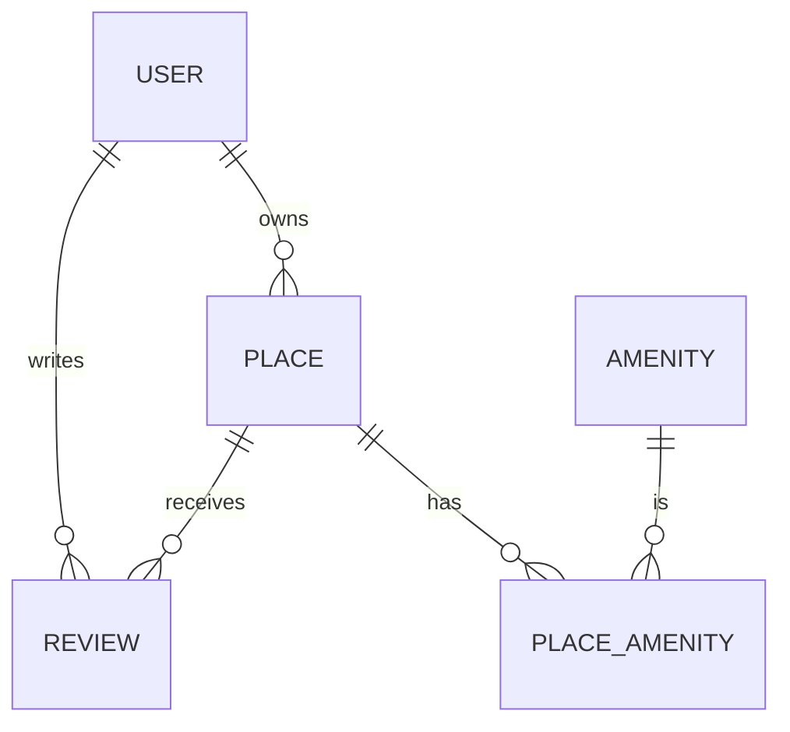

# HBnB - Part 3: Authentication, Authorization & Persistent Database (SQLAlchemy)

> **Advanced Backend for Airbnb Clone**
> Secure REST API with JWT authentication, role-based authorization, and full database integration (SQLite/MySQL) using SQLAlchemy.


---

## 📑 Table of Contents

- [📘 Overview](#-overview)
- [🏗️ Project Structure](#-project-structure)
- [⚙️ Technologies](#-technologies)
- [🚀 Getting Started](#-getting-started)
- [🔧 Configuration](#-configuration)
- [🧠 Core Business Models & Database Schema](#-core-business-models--database-schema)
- [🔒 Authentication & Authorization](#-authentication--authorization)
- [🔌 API Endpoints](#-api-endpoints)
- [✅ Validation & Security](#-validation--security)
- [🧪 Testing](#-testing)
- [🗺️ Database Design Diagram](#-database-design-diagram)
- [📚 Resources](#-resources)
- [👥 Authors](#-authors)
- [📄 License](#-license)

---

## 📘 Overview

This is **Part 3** of the HBnB project, a full-stack Airbnb clone focused on robust backend engineering.
In this phase, the application now features:

- **JWT Authentication**: Secure login, protected endpoints, session management.
- **Role-Based Authorization**: User roles (`admin` vs `regular user`), protected admin endpoints.
- **Persistent Database**: Full CRUD with **SQLAlchemy ORM**, using **SQLite** for development and ready for **MySQL** in production.
- **Advanced Data Validation**: Integrity, constraints, and security at the model and API level.
- **Database Schema Visualization**: Modern ER diagrams with **mermaid.js**.

The backend is now production-ready, scalable, and secure, supporting all major API features with persistent data.

---

## 🏗️ Project Structure

```
part3/
├── app/                        # Main application package
│   ├── __init__.py             # Initializes Flask app and registers namespaces
│   ├── extensions.py           # Initializes Flask extensions (db, bcrypt, jwt)
│
│   ├── api/                    # Presentation layer (RESTful API)
│   │   ├── __init__.py         # Registers all versioned API namespaces
│   │   └── v1/                 # Version 1 of the API
│   │       ├── __init__.py         # Initializes v1 namespace
│   │       ├── auth.py             # Authentication and authorization utilities (JWT, RBAC)
│   │       ├── users.py            # Endpoints for User CRUD operations
│   │       ├── admin_users.py      # Admin-only User endpoints (RBAC)
│   │       ├── places.py           # Endpoints for Place CRUD operations
│   │       ├── admin_places.py     # Admin-only Place endpoints
│   │       ├── reviews.py          # Endpoints for Review CRUD + delete
│   │       ├── admin_reviews.py    # Admin-only Review endpoints
│   │       ├── amenities.py        # Endpoints for Amenity CRUD operations
│   │       └── admin_amenities.py  # Admin-only Amenity endpoints
│
│   ├── models/                 # Business logic and domain entities
│   │   ├── __init__.py         # Initializes models module
│   │   ├── base_model.py       # BaseModel: shared UUID, timestamps, update()
│   │   ├── user.py             # User entity with validation
│   │   ├── place.py            # Place entity with owner, amenities, reviews
│   │   ├── review.py           # Review entity linked to User and Place
│   │   └── amenity.py          # Amenity entity
│
│   ├── services/               # Application layer using Facade pattern
│   │   ├── __init__.py         # Creates singleton `facade` instance
│   │   └── facade.py           # HBnBFacade: central coordinator for logic & data access
│
│   └── persistence/            # Persistence layer (in-memory & SQLAlchemy)
│       ├── __init__.py             # Initializes persistence module
│       ├── repository.py           # Repository interface + InMemoryRepository + SQLAlchemyRepository
│       └── user_repository.py      # UserRepository for user-specific queries
│
├── instance/
│   └── development.db          # SQLite database for development (ignored in VCS)
│
├── tests/                      # Unit and integration tests
│   ├── __init__.py             # Initializes test package
│   ├── test_base_model.py      # Tests for BaseModel functionality
│   ├── test_users_api.py       # API tests: /users
│   ├── test_places_api.py      # API tests: /places
│   ├── test_reviews_api.py     # API tests: /reviews
│   ├── test_amenities_api.py   # API tests: /amenities
│   ├── test_user_model.py      # Model tests: User
│   ├── test_place_model.py     # Model tests: Place
│   ├── test_review_model.py    # Model tests: Review
│   └── test_amenity_model.py   # Model tests: Amenity
│
├── config.py                   # App config classes: Config, DevelopmentConfig, ENV loading
├── run.py                      # Entry point to launch the Flask app
├── requirements.txt            # Project dependencies (Flask, Flask-RESTx, SQLAlchemy, JWT, etc.)
└── README.md                   # Project documentation
```

---

## ⚙️ Technologies

- **Python 3.8+**
- **Flask 2.x** — backend web framework
- **Flask-RESTx** — REST API + Swagger docs
- **SQLAlchemy** — ORM, full RDBMS abstraction
- **Alembic** — database migrations
- **SQLite** — local development database
- **MySQL** — production database (ready)
- **Flask-JWT-Extended** — JWT authentication and sessions
- **bcrypt** — password hashing
- **python-dotenv** — environment configuration

---

## 🚀 Getting Started

### 1. Clone the repository

```bash
git clone https://github.com/IEyZens/holbertonschool-hbnb.git
cd holbertonschool-hbnb/part3
```

### 2. Create a virtual environment

```bash
python3 -m venv venv
source venv/bin/activate
# On Windows: venv\Scripts\activate
```

### 3. Install dependencies

```bash
pip install -r requirements.txt
```

### 4. Configure environment variables

Create a `.env` file at the root (recommended):

```env
FLASK_ENV=development
SECRET_KEY=a-very-secret-key
DATABASE_URL=sqlite:///hbnb.db
JWT_SECRET_KEY=another-secret-key
```

### 5. Initialize the database

```bash
flask db upgrade
```

### 6. Run the application

```bash
python run.py
```

- API available at: `http://127.0.0.1:5000/api/v1/`
- Swagger UI: `http://127.0.0.1:5000/`

---

## 🔧 Configuration

- All config in `config.py` (supports environment variables and `.env`).
- Default: SQLite for development, MySQL for production (set via `DATABASE_URL`).
- JWT and Flask secret keys must be set.

---

## 🧠 Core Business Models & Database Schema

All entities extend a shared `BaseModel` (with id, timestamps, update helpers).

### **User**

- Fields: `id`, `first_name`, `last_name`, `email` (unique), `password_hash`, `is_admin`
- Relationships: Owns many `Place`, writes many `Review`
- Password stored as bcrypt hash (never in plain text)

### **Place**

- Fields: `id`, `title`, `description`, `price`, `latitude`, `longitude`, `owner_id`
- Relationships: Many `Review`, many-to-many with `Amenity` (via association table), belongs to `User`

### **Review**

- Fields: `id`, `text`, `rating` (1–5), `user_id`, `place_id`
- Relationships: Belongs to `User` and `Place`

### **Amenity**

- Fields: `id`, `name`
- Relationships: Many-to-many with `Place`

#### Example: SQLAlchemy Model (User)

```python
class User(Base):
    __tablename__ = 'users'
    id = Column(UUID(as_uuid=True), primary_key=True, default=uuid.uuid4)
    first_name = Column(String(128), nullable=False)
    last_name = Column(String(128), nullable=False)
    email = Column(String(256), unique=True, nullable=False)
    password_hash = Column(String(256), nullable=False)
    is_admin = Column(Boolean, default=False)
    # relationships ...
```

---

## 🔒 Authentication & Authorization

- **Registration**: `/api/v1/auth/register` — hashed password, unique email.
- **Login**: `/api/v1/auth/login` — returns JWT access token.
- **JWT Verification**: All protected endpoints require a valid token.
- **Role-Based Access**: Admin-only actions checked via `is_admin`.
- **Sessionless**: Stateless backend, all session info in JWT.

---

## 🔌 API Endpoints

### **Authentication**

| Method | Endpoint         | Description                      |
| ------ | ---------------- | -------------------------------- |
| POST   | `/auth/register` | Register a new user              |
| POST   | `/auth/login`    | Log in, obtain JWT               |
| GET    | `/auth/me`       | Get current user info (JWT req.) |

### **Users**

| Method | Endpoint      | Description    | Auth Required | Admin Only |
| ------ | ------------- | -------------- | :-----------: | :--------: |
| POST   | `/users/`     | Create user    |      Yes      |    Yes     |
| GET    | `/users/`     | List all users |      Yes      |    Yes     |
| GET    | `/users/<id>` | Get user by ID |      Yes      |    Yes     |
| PUT    | `/users/<id>` | Update user    |      Yes      |    Yes     |
| DELETE | `/users/<id>` | Delete user    |      Yes      |    Yes     |

### **Places**

| Method | Endpoint       | Description     | Auth Required |
| ------ | -------------- | --------------- | :-----------: |
| POST   | `/places/`     | Create place    |      Yes      |
| GET    | `/places/`     | List all places |      No       |
| GET    | `/places/<id>` | Get place by ID |      No       |
| PUT    | `/places/<id>` | Update place    |      Yes      |
| DELETE | `/places/<id>` | Delete place    |      Yes      |

### **Reviews**

| Method | Endpoint                     | Description              | Auth Required |
| ------ | ---------------------------- | ------------------------ | :-----------: |
| POST   | `/reviews/`                  | Create review            |      Yes      |
| GET    | `/reviews/`                  | List all reviews         |      No       |
| GET    | `/reviews/<id>`              | Get review by ID         |      No       |
| PUT    | `/reviews/<id>`              | Update review            |      Yes      |
| DELETE | `/reviews/<id>`              | Delete review            |      Yes      |
| GET    | `/places/<place_id>/reviews` | List reviews for a place |      No       |

### **Amenities**

| Method | Endpoint          | Description       | Auth Required |
| ------ | ----------------- | ----------------- | :-----------: |
| POST   | `/amenities/`     | Create amenity    |      Yes      |
| GET    | `/amenities/`     | List amenities    |      No       |
| GET    | `/amenities/<id>` | Get amenity by ID |      No       |
| PUT    | `/amenities/<id>` | Update amenity    |      Yes      |
| DELETE | `/amenities/<id>` | Delete amenity    |      Yes      |

**All endpoints return JSON.**
**Swagger UI available for interactive exploration.**

---

## ✅ Validation & Security

- **Password Security**: bcrypt hash, never stored or transmitted in plain.
- **Email Uniqueness**: enforced at database and API level.
- **JWT**: All sensitive endpoints protected; tokens required in `Authorization: Bearer`.
- **Field Validation**: Email format, lat/lon bounds, rating (1-5), required fields.
- **Input Sanitization**: Prevents SQL injection and XSS.
- **Admin endpoints**: Only accessible to users with `is_admin=True`.

---

## 🧪 Testing

### 1. Manual (cURL)

```bash
curl -X POST http://127.0.0.1:5000/api/v1/auth/register \
  -H "Content-Type: application/json" \
  -d '{"first_name": "Alice", "last_name": "Smith", "email": "alice@example.com", "password": "supersecret"}'
```

### 2. Interactive (Swagger UI)

Visit [http://127.0.0.1:5000/](http://127.0.0.1:5000/) for live API docs and testing.

### 3. Automated (unittest)

```bash
python3 -m unittest discover -s tests -p "test_*.py"
```

#### Example: Test JWT-protected endpoint

```python
def test_protected_route(self):
    # Login first to get JWT
    res = self.client.post('/api/v1/auth/login', json={
        'email': 'alice@example.com',
        'password': 'supersecret'
    })
    token = res.json['access_token']
    # Access protected endpoint
    res = self.client.get('/api/v1/users/', headers={
        'Authorization': f'Bearer {token}'
    })
    self.assertEqual(res.status_code, 200)
```

---

## 🗺️ Database Design Diagram

**Entity-Relationship Diagram with mermaid.js:**



---

## 📚 Resources

- [Flask-JWT-Extended Documentation](https://flask-jwt-extended.readthedocs.io/en/stable/)
- [SQLAlchemy Documentation](https://docs.sqlalchemy.org/en/20/)
- [Alembic Migrations](https://alembic.sqlalchemy.org/)
- [SQLite Documentation](https://sqlite.org/docs.html)
- [MySQL Documentation](https://dev.mysql.com/doc/)
- [Mermaid.js ER Diagrams](https://mermaid-js.github.io/mermaid/#/entityRelationshipDiagram)
- [Flask Documentation](https://flask.palletsprojects.com/en/2.0.x/)

---

## 👥 Authors

Developed by Thomas Roncin as part of Holberton School's full-stack curriculum.

---

## 📄 License

This project is for educational purposes and licensed under the Holberton School Terms of Service.
See [Holberton School’s License Policy](https://www.holbertonschool.com/terms-of-service) for details.
